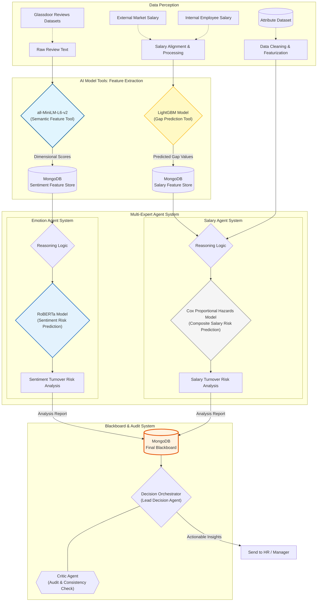

# RetentionAgent — AI-Powered Employee Retention Platform

RetentionAgent is an end-to-end people analytics system that combines machine learning models and large language models to give HR teams and managers an early warning system for employee flight risk. It scores every employee's attrition probability, identifies root causes (salary gaps, career stagnation, workload stress), and generates personalised AI retention recommendations — all surfaced through a clean web dashboard.

---

## Live Demo

| Component | URL |
|-----------|-----|
| Frontend (GitHub Pages) | https://wan519.github.io/6600 |
| Backend API (Render) | https://retentionagent.onrender.com |

**Demo accounts**

| Role | Username | Password |
|------|----------|----------|
| HR Admin | `hr_admin` | `hr2026` |
| Manager (Sales) | `mgr_lead` | `mgr2026` |
| Manager (Engineering) | `mgr_eng` | `mgr2026` |

---

## System Architecture



---

## Models

### Self-Trained Models

#### 1. LightGBM Salary Regression — `models/agent_salary_regressor.pkl`

| Item | Detail |
|------|--------|
| Algorithm | LightGBM gradient boosted trees |
| Task | Regression — predict an employee's fair monthly income (log1p-transformed target) |
| Training data | IBM HR Analytics dataset (`data/Attrition.csv`) |
| Input features | 25 features: role, tenure, performance, department, business travel, stock options, education field, and more (see `agents/equity/equity_agent.py` for the full ordered feature list) |
| Key engineered features | `Market_Median_2026` (BLS CPI-adjusted benchmark), `Internal_Salary_Rank`, `Performance_Consistency` |
| Output | Predicted fair annual salary — compared against actual salary to compute internal equity gap (`internal_gap_pct`) and external market gap (`external_gap_pct`) |
| Used by | Equity Agent (`agents/equity/equity_agent.py`) |

#### 2. Cox Proportional Hazard Survival Model — `models/cox_retention_v1.pkl`

| Item | Detail |
|------|--------|
| Algorithm | Cox Proportional Hazard model (lifelines library) |
| Task | Survival analysis — model the time-to-attrition hazard for each employee |
| Training data | IBM HR Analytics dataset — duration: `YearsAtCompany`, event: `Attrition == 'Yes'` |
| Input features | `MonthlyIncome`, `YearsSinceLastPromotion`, `OverTime_flag`, `WorkLifeBalance`, `JobSatisfaction`, `EnvironmentSatisfaction`, `JobLevel`, `StockOptionLevel`, and others (full list in `models/cox_retention_v1_features.json`) |
| Output | Partial hazard score per employee → percentile-ranked into Low / Mid / High risk buckets (top 10% = High, 50–90% = Mid, bottom 50% = Low) |
| Risk combination | Cox bucket + salary gap tier are combined by taking the higher of the two signals |
| Used by | Retention Agent (`agents/retention/risk_scorer.py`) |

---

### Pre-Trained Models (HuggingFace)

#### 3. `sentence-transformers/all-MiniLM-L6-v2`

| Item | Detail |
|------|--------|
| Type | Sentence embedding model (Sentence-Transformers) |
| Task | Encode Glassdoor review text and topic definitions into vector space; assign topic labels via cosine similarity |
| Topics detected | `sem_management`, `sem_salary`, `sem_workload`, `sem_career` |
| Threshold | Cosine similarity > 0.35 → binary label assigned to that topic |
| Hardware | Runs on Apple MPS (Apple Silicon) when available, falls back to CPU |
| Used by | Emotion Agent (`tools/emotion_tool.py`) |

#### 4. `cardiffnlp/twitter-roberta-base-sentiment-latest`

| Item | Detail |
|------|--------|
| Type | RoBERTa fine-tuned on Twitter data (HuggingFace `transformers` pipeline) |
| Task | Sentiment polarity classification — outputs Positive / Neutral / Negative label + confidence score per review |
| Input truncation | Review "cons" text is truncated to 1000 characters to stay within RoBERTa's 512-token limit |
| Output stored | `roberta_label`, `roberta_score` per review → persisted to MongoDB `reviews_analysis` collection |
| Used by | Emotion Agent (`tools/emotion_tool.py`) |

---

### LLM — Claude claude-opus-4-6 (Anthropic)

| Agent | Role |
|-------|------|
| Retention Agent | Analyzes Cox + salary gap scores for High/Mid risk employees in batches of 50; outputs structured HR insights (risk summary, root causes, urgency, recommendations) |
| Recommendation Agent | Tool-use agentic loop — calls `get_employee_profiles` then `save_recommendations`; generates weighted per-employee retention plans with routing (HR vs. Management) |
| Recommendation Audit Agent | Adversarial critic — reviews recommendation quality against 5 rule categories (weight validity, score consistency, specificity, routing, priority calibration); returns APPROVED / NEEDS_REVIEW / REJECTED verdict |
| Emotion Agent | Synthesizes Glassdoor NLP results into a structured company-level sentiment report after calling three tools in sequence |

---

## Key Features

- **Three-agent ML pipeline** — Equity Agent (LightGBM), Retention Agent (Cox survival model), and Emotion Agent (NLP) run sequentially and write enriched results to MongoDB
- **AI retention recommendations** — Claude API (tool-use agentic loop) generates per-employee retention plans; an adversarial Critic Agent audits quality and forces revision before saving
- **Role-based access control** — HR sees the full workforce; managers see only their department's high/mid-risk employees
- **Interactive web dashboard** — employee risk cards with attrition gauge, salary gap data, AI recommendations, and key concern breakdowns

---

## Project Structure

```
RetentionAgent/
├── agents/
│   ├── equity/               # Agent 1: salary equity scoring (LightGBM)
│   ├── retention/            # Agent 2: attrition risk scoring (Cox + Claude)
│   ├── emotion/              # Agent 3: Glassdoor NLP sentiment analysis
│   ├── recommendation/       # Claude API recommendation generator (tool-use)
│   ├── recommendation_audit/ # Adversarial Claude audit agent
│   ├── risk_audit/           # Risk score audit agent
│   └── pipeline/             # Orchestrator (generate → audit → save loop)
├── api/
│   └── server.py             # FastAPI backend (login, employees endpoints)
├── scripts/
│   ├── MockData.py           # Seed mock employee data into MySQL
│   ├── database_mysql.py     # MySQL connection pool manager (Aiven)
│   ├── generate_mock_dataset.py
│   └── upload_mock_dataset.py
├── tools/
│   ├── attrition_tools.py    # Cox model helpers
│   ├── emotion_tool.py       # Glassdoor embedding + sentiment tools
│   ├── market_logic.py       # BLS market salary benchmark logic
│   ├── mongoDB.py            # MongoDB connection helper
│   └── recommendation_tools.py
├── models/                   # Trained model artifacts (.pkl, .json)
├── data/                     # CSV datasets
├── retention-ui/             # React + Vite frontend
│   └── src/
│       └── App.jsx           # Single-page app (Home, Login, Portal, HR, Manager)
├── main.py                   # Pipeline entry point
├── run_all_agents.py         # Run all agents in sequence
└── config.env                # Credentials (not committed)
```

---

## Setup & Installation

### Prerequisites

- Python 3.11+
- Node.js 18+
- MongoDB instance (Aiven or local)
- MySQL instance (Aiven or local)

### 1. Clone & configure

```bash
git clone https://github.com/WAN519/6600.git
cd RetentionAgent
cp config.env.example config.env   # fill in your credentials
```

### 2. Install Python dependencies

```bash
pip install -r requirements.txt
```

### 3. Seed the MySQL mock database

```bash
python scripts/MockData.py
```

### 4. Run the ML pipeline

```bash
# Sync BLS market salary benchmarks first
python -m agents.equity.run

# Run the full three-agent pipeline
python main.py

# Generate AI retention recommendations
python -m agents.pipeline.pipeline --month 2026-04
```

### 5. Start the backend API

```bash
uvicorn api.server:app --reload --port 8000
```

### 6. Start the frontend

```bash
cd retention-ui
npm install
npm run dev
# Open http://localhost:5173
```

---

## Team Contributions

### Member 1 — ML Pipeline & Agents

| Area | Details |
|------|---------|
| Equity Agent | LightGBM salary regression model, BLS market benchmark integration (`agents/equity/`) |
| Retention Agent | Cox Proportional Hazard survival model, salary risk scoring, Claude API HR analysis (`agents/retention/`) |
| Emotion Agent | Sentence-Transformers (all-MiniLM-L6-v2) embedding, RoBERTa sentiment classification, Glassdoor NLP pipeline (`agents/emotion/`, `tools/emotion_tool.py`) |
| Recommendation Pipeline | Claude tool-use recommendation generator + adversarial audit loop (`agents/recommendation/`, `agents/recommendation_audit/`, `agents/pipeline/`) |
| MongoDB Schema Design | Collection design for Equity_Predictions, Risk, retention_recommendations |

### Member 2 — API & Data Infrastructure

| Area | Details |
|------|---------|
| FastAPI Backend | `/api/login` and `/api/employees` endpoints, role-based data filtering, MongoDB query logic (`api/server.py`) |
| Mock Data Scripts | Employee dataset generation and MySQL seeding (`scripts/MockData.py`, `scripts/database_mysql.py`) |
| Deployment | GitHub Pages (frontend), Render (FastAPI backend), CORS and environment configuration |
| Data Pipeline Support | CSV preprocessing, MongoDB upload scripts, dataset management (`scripts/`) |

### AI-Generated — Frontend

The React frontend (`retention-ui/src/App.jsx`) was fully generated with the assistance of Claude (Anthropic). This includes the complete single-page application architecture — Home, Login, Portal, HR Dashboard, and Manager View — along with all UI components, role-based routing logic, API integration, and visual design. AI-assisted development was used to accelerate prototyping and iterate rapidly on the dashboard layout and interaction design.

---

## Next Steps

### 1. Replace mock data with live MySQL data

Currently, employee records are generated by `scripts/MockData.py` and served from MongoDB. The next iteration will connect the ML pipeline output directly to the MySQL database, so the HR dashboard reflects live, database-backed records rather than static mock data.

### 2. Migrate user authentication to MySQL

The current login system uses a hardcoded credentials dictionary in `api/server.py`:

```python
USERS = {
    "hr_admin": {"password": "hr2026",  "role": "hr",      "dept": None},
    "mgr_lead": {"password": "mgr2026", "role": "manager", "dept": "Sales"},
    ...
}
```

The planned upgrade is to store all user accounts, hashed passwords, roles, and department assignments in a `users` table in MySQL. The `/api/login` endpoint will query this table via the existing `DatabaseManager` in `scripts/database_mysql.py`, enabling dynamic account creation and proper credential management without touching the source code.

---

## Tech Stack

| Layer | Technology |
|-------|-----------|
| ML Models | LightGBM, Cox Proportional Hazard, Sentence-Transformers, RoBERTa |
| LLM | Claude API — `claude-opus-4-6` (Anthropic) |
| Backend | FastAPI, pymongo, mysql-connector-python |
| Database | MongoDB (risk scores & recommendations), MySQL (user & employee data) |
| Frontend | React 18, Vite |
| Deployment | GitHub Pages, Render |

---

## Data Sources

- **IBM HR Analytics Dataset** — `data/ibm_enhanced_test.csv` — synthetic employee attrition data used for model training and scoring
- **BLS Occupational Employment Statistics** — market salary benchmarks fetched via `agents/equity/run.py`
- **Glassdoor Reviews** — `glassdoor_reviews.csv` (~280 MB, not committed) — used by the Emotion Agent for NLP sentiment analysis